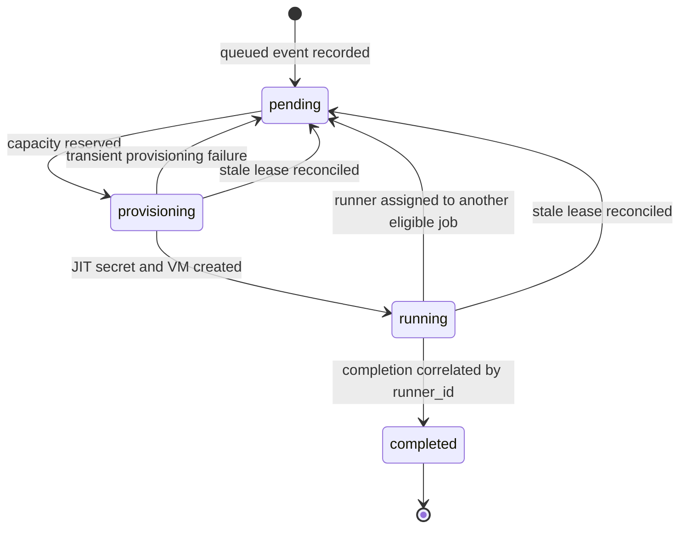

# Controller state machine

Firestore is the durable source of controller state. GitHub remains the source
of truth for workflow scheduling.

## Idempotency

- GitHub's delivery ID becomes the Cloud Task ID. A repeated delivery returns
  `ALREADY_EXISTS` and is acknowledged as a duplicate.
- Firestore creates a job document only once.
- Completion cleanup is repeatable: deleting an absent VM or secret succeeds.
- Capacity changes occur inside Firestore transactions.
- Completion uses `workflow_job.runner_id`, because GitHub may assign any
  matching runner to any eligible queued job.

## Recovery

Cloud Tasks retries transient task failures with exponential backoff. Cloud
Scheduler runs reconciliation every five minutes. A job whose provisioning or
running lease exceeds the configured limit is cleaned and returned to pending.
Compute Engine independently enforces a 45-minute runner lifetime.
